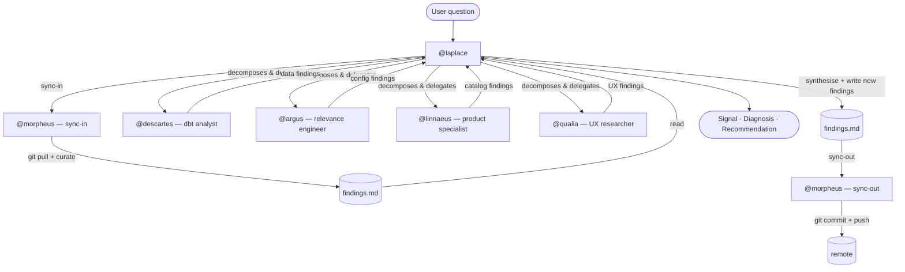
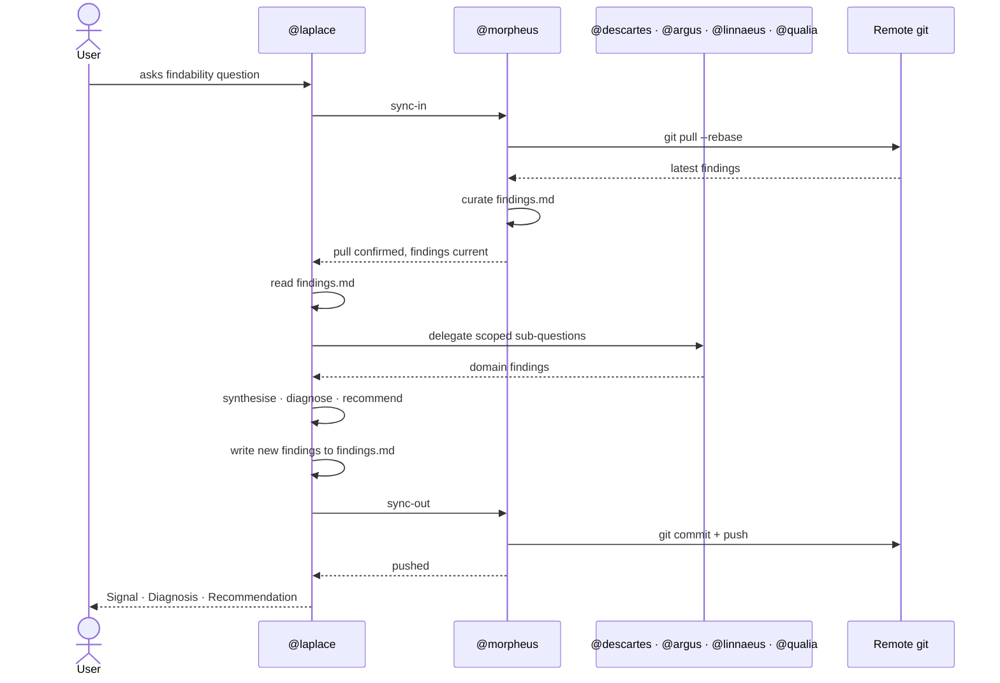

## DBT coding agent
- OpenCode
- DBT MCP
## Analyst Agent
### first version
- opencode
- parquet file with metrics
- duckdb

### second version
- opencode
- DBT MCP

### final version
- langchain?
- connected through Slack/Teams
- DBT MCP

## Search specialist
### First version
- custom GPT

### Second/Final version
- langchain?
- Tools: 
	- connected through Elastic API and/or MCP
- Interface: connected through Slack/Teams

Every `@laplace` session follows this flow. Morpheus bookends the work to keep

`findings.md` current and shared across all installations.

  

  

`@morpheus` can also be invoked directly or via `/curate-findings` to run a standalone

curation and sync cycle outside of a `@laplace` session.

