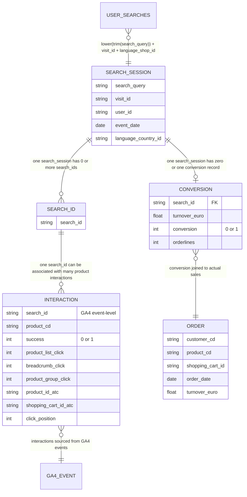

```mermaid
erDiagram
    USER_SEARCHES }o--|| SEARCH_SESSION : "lower(trim(search_query)) + visit_id + language_shop_id"
    SEARCH_SESSION ||--o{ SEARCH_ID : "one search_session has 0 or more search_ids"
    SEARCH_ID ||--o{ INTERACTION : "one search_id can be associated with many product interactions"
    SEARCH_SESSION ||--o| CONVERSION : "one search_session has zero or one conversion record"
    INTERACTION }o--|| GA4_EVENT : "interactions sourced from GA4 events"
    CONVERSION }o--|| ORDER : "conversion joined to actual sales"

    SEARCH_SESSION {
        string search_query
        string visit_id
        string user_id
        date event_date
        string language_country_id
    }

	SEARCH_ID {
		string search_id
	}
	
    INTERACTION {
        string search_id "GA4 event-level"
        string product_cd
        int success "0 or 1"
        int product_list_click
        int breadcrumb_click
        int product_group_click
        string product_id_atc
        string shopping_cart_id_atc
        int click_position
    }

    CONVERSION {
        string search_id FK
        float turnover_euro
        int conversion "0 or 1"
        int orderlines
    }

    ORDER {
        string customer_cd
        string product_cd
        string shopping_cart_id
        date order_date
        float turnover_euro
    }
```
